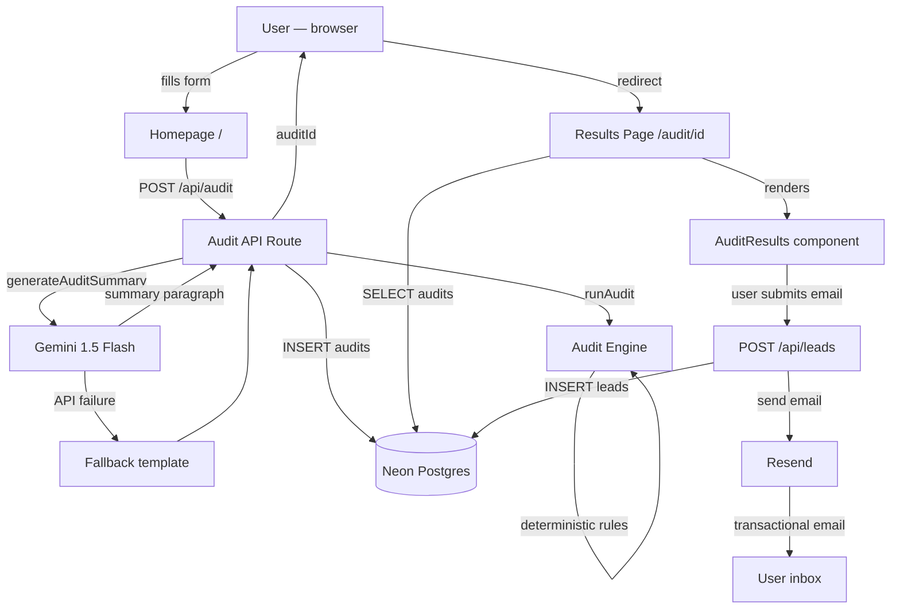

# ARCHITECTURE.md

## System diagram

---

## Data flow — how input becomes an audit result

**Step 1 — Form submission**
User fills the spend input form. React Hook Form validates against a Zod schema client-side. On submit, the form data (`AuditFormValues`) is POST'd to `/api/audit` as JSON.

**Step 2 — Server validation**
The API route re-validates with the same Zod schema server-side. Never trust client validation alone.

**Step 3 — Audit engine**
`runAudit(inputData)` runs four deterministic rules against each tool:
1. Is this a team-tier plan with fewer than 3 seats? → downgrade
2. Is there a cheaper plan from the same vendor that fits the use case? → downgrade
3. Is there a substantially cheaper alternative tool (>20% savings)? → switch
4. Is this API spend >$200/mo where Credex credits apply? → credits
5. None of the above → keep

No database reads. No API calls. Pure function. Always completes.

**Step 4 — AI summary**
Gemini 1.5 Flash generates a ~100-word summary paragraph from the audit result. If it fails for any reason, a data-driven fallback template is used. The audit is never blocked on this call.

**Step 5 — Persist**
The full audit (input + result) is saved to Postgres as two JSONB columns. A `nanoid(10)` slug is the primary key and the public URL.

**Step 6 — Results page**
The results page is a Next.js server component. It fetches the audit by ID, renders `AuditResults` (client component), and generates OG metadata for link previews.

**Step 7 — Lead capture**
Email submission hits `/api/leads`. Checks for duplicate email on same audit. Saves to `leads` table (separate from `audits` — PII isolation). Fires Resend transactional email. Email failure is non-fatal.

---

## Why this stack

**Next.js 15 (App Router)**
Server components for the results page means the audit data is fetched server-side — no loading spinner, no client-side fetch, correct OG tags rendered at request time. API routes co-locate with the app. Single deployment unit.

**Neon Postgres + Drizzle ORM**
Neon is serverless Postgres — scales to zero between requests, no connection management overhead. Drizzle gives full TypeScript inference on queries without the abstraction cost of Prisma. The schema is simple enough that an ORM isn't strictly needed, but type-safe queries reduce bugs at the DB boundary.

**Gemini 1.5 Flash over GPT-4o or Claude**
Three reasons: free tier is generous enough for this use case, latency is low (~1s for a 120-word response), and the assignment specified Anthropic API as preferred but permitted alternatives. Gemini was chosen over Anthropic API to avoid cost — documented honestly. The prompt is model-agnostic and would work identically on Claude or GPT-4o.

**React Hook Form + Zod**
The form has complex dynamic state (variable number of tool rows, cascading dropdowns). React Hook Form handles this with minimal re-renders. Zod provides the schema that's shared between the form and the API route — single source of truth for validation.

**Vitest over Jest**
Native ESM support, no Babel config, faster cold start. The audit engine is a pure TypeScript module — Vitest runs it directly without transformation overhead.

**Honeypot over CAPTCHA**
Lead capture needs to be frictionless — the user has already seen their savings, they're at peak motivation. CAPTCHA would add 5–10 seconds of friction at exactly the wrong moment. A honeypot hidden field (`name="website"`) catches automated form submissions with zero UX cost. Rate limiting via Upstash Redis is the next layer (implemented as a TODO — the IP logging stub in the leads route is the placeholder).

---

## Email delivery constraint

Resend's free tier restricts outgoing email to verified addresses only until a sending domain is verified. In the current deployment, transactional emails are delivered to the verified account email. Production deployment would use a verified sending domain (e.g. `audit@tarka-ai.com`). The lead capture, DB persistence, and email template logic are fully implemented — this is a billing/infrastructure constraint, not a code gap.

---

## What I'd change for 10,000 audits/day

**Connection pooling**
The current Neon client uses `max: 1` connections — correct for low-traffic serverless but would need PgBouncer or Neon's built-in pooling configured properly at scale. Vercel's serverless functions spin up many instances simultaneously; without pooling, each instance opens its own connection and you hit Postgres connection limits fast.

**Rate limiting**
Replace the current IP-logging stub in `/api/leads` with Upstash Redis rate limiting (`@upstash/ratelimit`). The package is already in the install plan. At 10k audits/day, without rate limiting a single bad actor could exhaust the DB write budget.

**Audit result caching**
Identical inputs produce identical outputs from the audit engine. At scale, cache audit results in Redis by a hash of the input. Saves a DB write and a Gemini call for duplicate submissions (e.g. someone refreshing or resubmitting the same stack).

**Gemini call made async / non-blocking**
Currently the POST `/api/audit` waits for Gemini before returning. At scale, return the `auditId` immediately after the DB insert, then generate the summary asynchronously and update the row. The results page would poll or use a loading state for the summary paragraph only.

**Queue for email delivery**
Replace the direct Resend call with a queue (Upstash QStash or similar). Email delivery is currently synchronous and blocking — a Resend timeout would slow down the lead capture response. A queue decouples delivery from the request lifecycle.