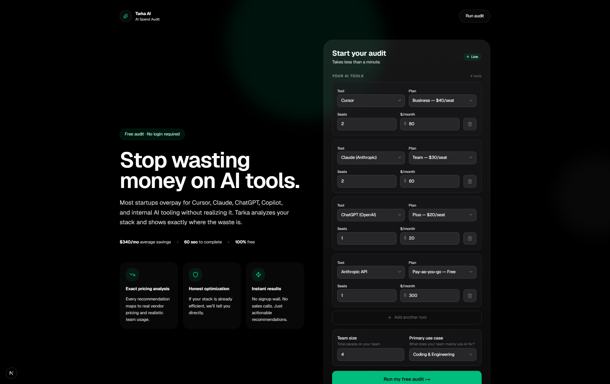
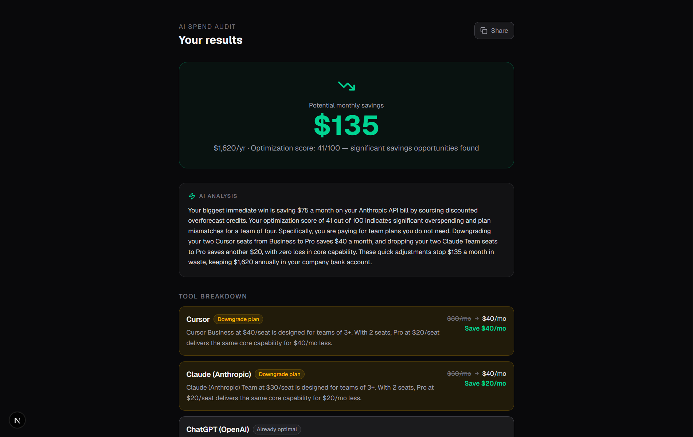
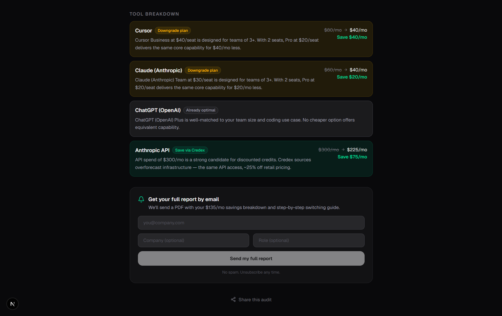

# Tarka AI — AI Spend Audit

A free tool for startup founders and engineering managers to find out if they're overpaying for AI tools. Input your subscriptions, get an instant audit with exact savings numbers, share the results. No login required.

**Live:** https://tarka-ai.vercel.app

---

## Screenshots

## Audit Form


## Audit Results


## Tool Breakdown


---

## Quick start

### Prerequisites
- Node.js 18+
- A Neon (or any Postgres) database
- Gemini API key (free tier works)
- Resend API key (free tier works)

### Install and run locally

```bash
git clone https://github.com/sadSanta-07/Tarka-AI
cd ai-spend-audit
npm install
```

Create `.env.local` at the root:

```env
DATABASE_URL="postgresql://..."
GEMINI_API_KEY="..."
RESEND_API_KEY="..."
```

Push the database schema:

```bash
npx drizzle-kit push
```

Start the dev server:

```bash
npm run dev
```

Open http://localhost:3000

### Run tests

```bash
npm run test
```

### Deploy

The project deploys to Vercel with zero config. Set the three environment variables above in your Vercel project settings.

```bash
vercel deploy
```

---

## Decisions

Five trade-offs I made and why:

**1. Hardcoded rules engine over LLM-generated recommendations**

The audit math is entirely deterministic. I made this choice because savings numbers need to be auditable — a finance person should be able to verify every figure against the source pricing page. LLMs hallucinate prices. A wrong number destroys trust in the tool. AI is used exactly once, for the prose summary, where a slightly imprecise word costs nothing.

**2. JSONB blobs over normalized columns for audit data**

Audit input and results are stored as JSONB in Postgres rather than normalized tables. The audit shape is complex (variable number of tools, nested recommendations) and will evolve as pricing changes. JSONB means schema changes don't require migrations. The tradeoff is that querying individual fields inside an audit is slower — acceptable because we only ever fetch one audit at a time by ID.

**3. Separate `leads` table instead of storing email on `audits`**

PII (email, company name) lives in `leads`, not `audits`. This keeps the public shareable URL clean by design — the audit route never touches the leads table. No risk of accidentally leaking email in an OG tag or API response.

**4. Honeypot over CAPTCHA for abuse protection**

CAPTCHA adds friction before the user has seen any value. This tool's entire conversion model depends on a frictionless first experience — fill in tools, see savings, then optionally give email. A honeypot hidden field catches most bots with zero UX cost. Documented in ARCHITECTURE.md.

**5. Windsurf over v0 as the 8th tool**

The spec offered "Windsurf or v0." Windsurf is a direct Cursor/Copilot competitor — it fits naturally into the coding tool category and produces meaningful audit comparisons. v0 is a UI generation tool with no per-seat pricing model comparable to the others. Windsurf makes the audit more useful for the primary user (engineering teams).

---

## Stack

- **Framework:** Next.js 15 (App Router)
- **Database:** Neon Postgres + Drizzle ORM
- **AI:** Gemini 1.5 Flash (summary generation)
- **Email:** Resend
- **Forms:** React Hook Form + Zod
- **Styling:** Tailwind CSS
- **Tests:** Vitest
- **Deploy:** Vercel